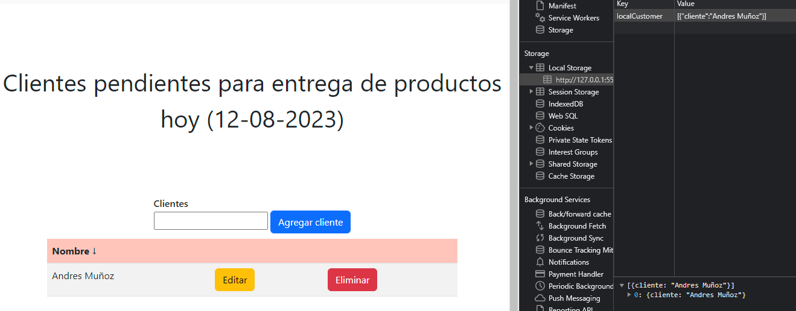
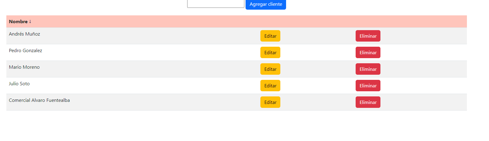

# Proyecto N°2: CRUD

Proyecto creado para la UDD que recive datos y los guarda en el local storage de la página para luego mostrarlos en una tabla. 
Los datos se pueden editar y eliminar. 
Todos los datos mostrados en el body de la tabla proceden del local storage.
Se usó HTML5, CSS y Javascript.    
Página creada con fines académicos.

## **ÍNDICE**

* [1. Navbar](#1-navbar)
* [2. Texto-título](#2-texto-título)
* [3. Input](#3-input)
* [4. Tabla](#4-tabla)
* [5. Footer](#5-footer)

****

## 1. Navbar

Posee el logo de la página y un buscador ficticio que debería ser la lista completa de clientes.

****

## 2. Texto-título

Habla del para qué sirven los datos de la tabla. Posee una funcion que muestra la fecha actualizada.

****

## 3. Input

Recibe datos que serán guardados en el local storage en forma de objeto y dentro de un arreglo.

****

## 4. Tabla

Sección donde se muestran los datos ingresados. Los datos proceden del local storage.

Los datos se pueden editar o eliminar. 

Al guardar se reemplaza el dato en local storage, en la tabla y al mismo tiempo el boton Agregar clientes vuelve a aparecer ocultando el boton Guardar clientes.

El boton eliminar quita datos del storage y , por lo tanto, de la tabla.

Si elimino todos los datos, solo me queda un arreglo vacío.

****

## 5. Footer

Información general e instagram ficticio de la página en caso de necesitarse.

****

Datos de contacto: andresestebanmu@gmail.com